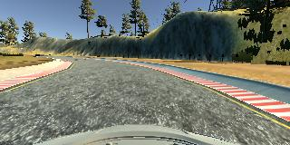
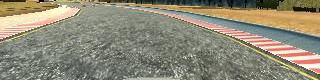
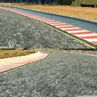

# **Behavioral Cloning** 

**Behavioral Cloning Project**

The goals / steps of this project are the following:

* Use the simulator to collect data of good driving behavior
* Build, a convolution neural network in Keras that predicts steering angles from images
* Train and validate the model with a training and validation set
* Test that the model successfully drives around track one without leaving the road
* Summarize the results with a written report

## Rubric Points
### Here I will consider the [rubric points](https://review.udacity.com/#!/rubrics/432/view) individually and describe how I addressed each point in my implementation.  

---
### Files Submitted & Code Quality

#### 1. Submission includes all required files and can be used to run the simulator in autonomous mode

My project includes the following files:

* `model.py` containing the script to create and train the model
* `drive.py` for driving the car in autonomous mode
* `model.h5` symlinked to `models/out3.h5` containing a trained convolution neural network 
* `writeup.md` summarizing the results
* [https://youtu.be/FZj4Chr1iFw](https://youtu.be/FZj4Chr1iFw) a screen recording shows the final model in action performing on the first track
* [https://youtu.be/C4sp2JlTItk](https://youtu.be/C4sp2JlTItk) video from track 1, made with video.py (--fps 120)
* [https://youtu.be/Fk--KcH6iWw](https://youtu.be/Fk--KcH6iWw) video from track 2, made with video.py, I will discuss it in the last section of this document
* model.png a dot graph showing the final architecture, generated by keras

#### 2. Submission includes functional code
Using the Udacity provided simulator and my drive.py file, the car can be driven autonomously around the track by executing 
```sh
python drive.py models/out3.h5
```

#### 3. Submission code is usable and readable

The model.py file contains the code for training and saving the convolution neural network. The file shows the pipeline I used for training and validating the model. The code is structured, the function and variable names are verbose, but it also contains comments to explain how the code works.

### Model Architecture and Training Strategy

#### 1. An appropriate model architecture has been employed

I built my model on top of the MobilNet conv layers supported by keras.applications. The idea behind it is that a pretrained network extract relevant features from the image and a custom top layer infers the target parameter from those features. I chose MobilNet because it shows quite a good classification performance compared to its low complexity. As I work on limited hardware (GeForce GTX 1060 6GB) it seemed a good start.

#### 2. Attempts to reduce overfitting in the model

The model contains several dropout layers to reduce overfitting (in function `build_model`).

The model was trained and validated on different data sets to ensure that the model was not overfitting. To choose a random 30% of the data to be the validation set I utilized the function `train_test_split` from `sklearn.model_selection` (in function `main`). The model was tested by running it through the simulator and ensuring that the vehicle could stay on the track.

#### 3. Model parameter tuning

I let some model parameters set through program arguments so I can launch training with different parameters quicker. The program help speaks for itself:

    Usage: model.py [-h] [--out [OUT]] [--learning_rate [LEARNING_RATE]]
                    [--batch_size [BATCH_SIZE]] [--epochs [EPOCHS]]
                    [--steering_compensation [STEERING_COMPENSATION]]
                    [--seed [SEED]] [--dropout [DROPOUT]]
                    [--init_stddev [INIT_STDDEV]]
                    [--width_multiplier [WIDTH_MULTIPLIER]] [--test]
                    [--plot_model]
                    search_path    

    Behavioral Cloning
    
    positional arguments:
      search_path           root folder to search for csv files recursively
    
    optional arguments:
      -h, --help            show this help message and exit
      --out [OUT]           output model file name
      --learning_rate [LEARNING_RATE]
                            learning rate for the training
      --batch_size [BATCH_SIZE]
                            batch size for the training
      --epochs [EPOCHS]     maximum number of epochs
      --steering_compensation [STEERING_COMPENSATION]
                            steering compensation value for the left and right
                            images in the dataset
      --seed [SEED]         random seed
      --dropout [DROPOUT]   dropout factor for the top layers
      --init_stddev [INIT_STDDEV]
                            initial trunc normal stddev for the top layers
      --width_multiplier [WIDTH_MULTIPLIER]
                            width multiplier for the top layers
      --test                limits the number of csv rows to process for getting
                            over the data processing quickly
      --plot_model          draw model.png showing the architecture

I used adam optimizer and the final model was trained by the following command:
    
    python model.py data --epochs 100 --out models/out3.h5 \
    --learning_rate 0.01 --steering_compensation 0.25 \
    --dropout 0.5 --batch_size 256 --width_multiplier 2
    
The parameter `stddev` is `0.01` by default.

I was playing mostly with `batch_size` and the `learning_rate`. Higher value than 256 for the `batch_size` exceeded my GPU memory capacity. I also tuned `dropout` and the `width_multiplier` parameter. I ended up with a rather strong dropout but two times wider top layers then I planned first.

#### 4. Appropriate training data

I used several datasets for training the final model that contained both proper and 'wobbly' driving to show the model how to keep and get back to the track. I also recorded the driving the two levels inversely. The final dataset contains 2-2 full laps and 1-1 shorter drive on the two levels.

### Architecture and Training Documentation

#### 1. Solution Design Approach

My 0th approach was employing a simple model to test that I can start training, generate model file, run drive.py and get the simulator work in autonomous mode.

Then I built a model used the full 320x160 image cut into two 160x160 halves and plugged in the halves into a 160x160 MobilNet conv model (without its original top fc layers). On top of that, after a flattening, a 2 fully connected layers was targeting the four parameters (steering, throttle, break, speed). It is worth mentioning that the implementation of MobilNet can only work with inputs of size 128x128, 160x160, 192x192 or 224x224.

MobilNet reduces the 160x160x3 image to a 5x5x1024 feature stack. 1024 seemed to be a lot to me so I reduced it to 256 using a 1x1 conv layer generating 256 feature maps. It reduced the number of tunable parameters and speeded up the training.

I put dropout layers to prevent overfitting. I also put batch normalization layers before the ReLUs reported to accelerate training ([https://arxiv.org/abs/1502.03167](https://arxiv.org/abs/1502.03167)).

I noticed that we only need to predict the steering so I removed all the other target parameters which drastically changed the range and dynamics of the training loss and accuracy.

I also put an activation function at the very end of the pipeline to limit the steering parameter to the range [-1,1]. First, by mistake, I used a sigmoid, but quickly changed to tanh as I saw the higher training loss and the only-right-steering car :).

I further simplified the model by dropping the irrelevant parts of the image. First I cut an 80x320 roi from the middle of the image where the road seems to be in the most frames. I cut it half (80x160 each) and stack them to form a 160x160 image. It seemed to be a bit risky approach because the image looses continuity at the stitching line but I gave it a try.







#### 2. Final Model Architecture

Using keras `summary()` the final model can be seen below. See `model.png` for

    __________________________________________________________________________________________________
    Layer (type)                    Output Shape         Param #     Connected to
    ==================================================================================================
    input_1 (InputLayer)            (None, 160, 320, 3)  0
    __________________________________________________________________________________________________
    lambda_1 (Lambda)               (None, 160, 320, 3)  0           input_1[0][0]
    __________________________________________________________________________________________________
    cropping2d_1 (Cropping2D)       (None, 80, 160, 3)   0           lambda_1[0][0]
    __________________________________________________________________________________________________
    cropping2d_2 (Cropping2D)       (None, 80, 160, 3)   0           lambda_1[0][0]
    __________________________________________________________________________________________________
    concatenate_1 (Concatenate)     (None, 160, 160, 3)  0           cropping2d_1[0][0]
                                                         cropping2d_2[0][0]
    __________________________________________________________________________________________________
    mobilenet_1.00_160 (Model)      (None, 5, 5, 1024)   3228864     concatenate_1[0][0]
    __________________________________________________________________________________________________
    dropout_1 (Dropout)             (None, 5, 5, 1024)   0           mobilenet_1.00_160[1][0]
    __________________________________________________________________________________________________
    conv2d_1 (Conv2D)               (None, 5, 5, 256)    262400      dropout_1[0][0]
    __________________________________________________________________________________________________
    batch_normalization_1 (BatchNor (None, 5, 5, 256)    1024        conv2d_1[0][0]
    __________________________________________________________________________________________________
    activation_1 (Activation)       (None, 5, 5, 256)    0           batch_normalization_1[0][0]
    __________________________________________________________________________________________________
    dropout_2 (Dropout)             (None, 5, 5, 256)    0           activation_1[0][0]
    __________________________________________________________________________________________________
    flatten_1 (Flatten)             (None, 6400)         0           dropout_2[0][0]
    __________________________________________________________________________________________________
    dense_1 (Dense)                 (None, 512)          3277312     flatten_1[0][0]
    __________________________________________________________________________________________________
    batch_normalization_2 (BatchNor (None, 512)          2048        dense_1[0][0]
    __________________________________________________________________________________________________
    activation_2 (Activation)       (None, 512)          0           batch_normalization_2[0][0]
    __________________________________________________________________________________________________
    dropout_3 (Dropout)             (None, 512)          0           activation_2[0][0]
    __________________________________________________________________________________________________
    dense_2 (Dense)                 (None, 128)          65664       dropout_3[0][0]
    __________________________________________________________________________________________________
    batch_normalization_3 (BatchNor (None, 128)          512         dense_2[0][0]
    __________________________________________________________________________________________________
    activation_3 (Activation)       (None, 128)          0           batch_normalization_3[0][0]
    __________________________________________________________________________________________________
    dense_3 (Dense)                 (None, 1)            129         activation_3[0][0]
    __________________________________________________________________________________________________
    activation_4 (Activation)       (None, 1)            0           dense_3[0][0]
    ==================================================================================================
    Total params: 6,837,953
    Trainable params: 3,607,297
    Non-trainable params: 3,230,656

#### 3. Creation of the Training Set & Training Process

Driving each of the two levels I collected a clockwise full lap, a counter-clockwise full lap and shorter periods focusing on recovering from near off-tracks and sharper turns of the road. All in all, I recorded 6 datasets. I also changed the simulator quality between the records, hoping to add slightly more variance to the data.

`model.py` expects a root dir path that is scanned for csv files recursively. The csv files are loaded along with the images referred in them. Steering field is additively generated for the left and right images using the steering value for the center images and the `steering_compensation` parameter. (functions `import_dataframe` and `import_data`)

All the images are duplicated and flipped horizontally with their steering values inverted (`append_mirrored_data`). The whole dataset is shuffled, then a 30% of the data is stored as the validation data, the rest of them is the training data. It means 33520 samples for training and 14366 samples for validation. For testing I was using the simulator.

I also challanged my models on the second track during the development. The last model performs well, can almost finish the lap but it keeps missing one of the last turns which is visually sliced through with a sharp shadow. I believe that the straight shadow edge is treated as the other side of the road instead of the real one.